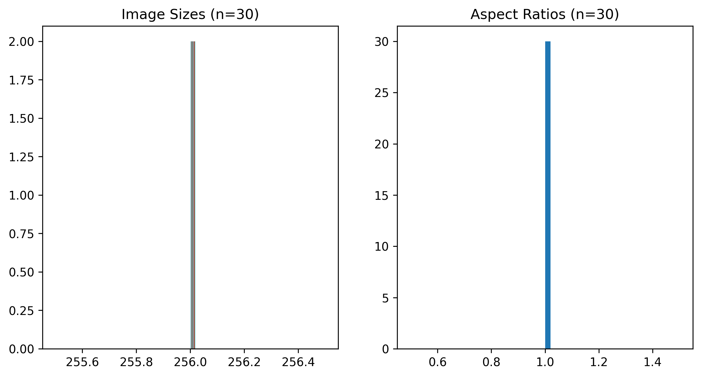
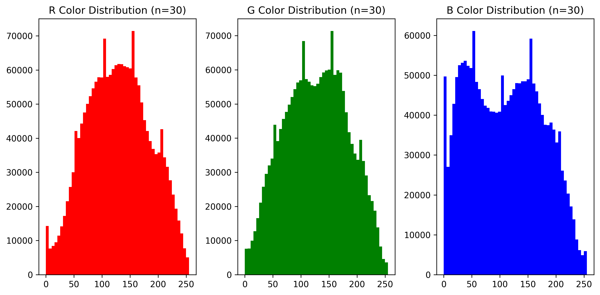
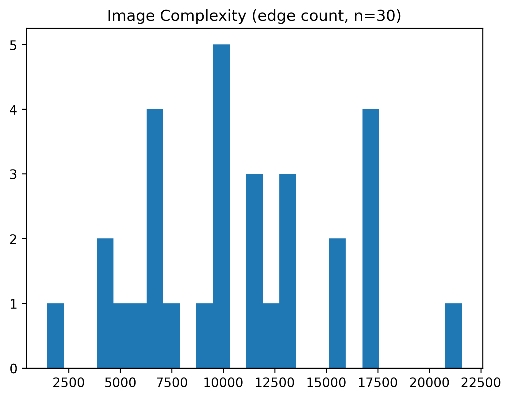
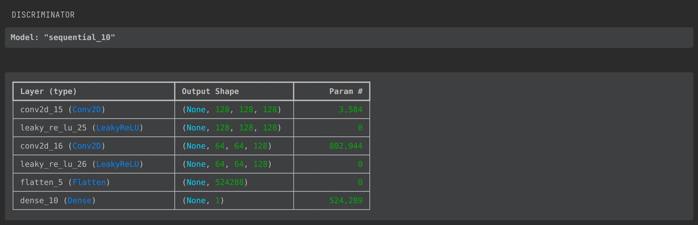
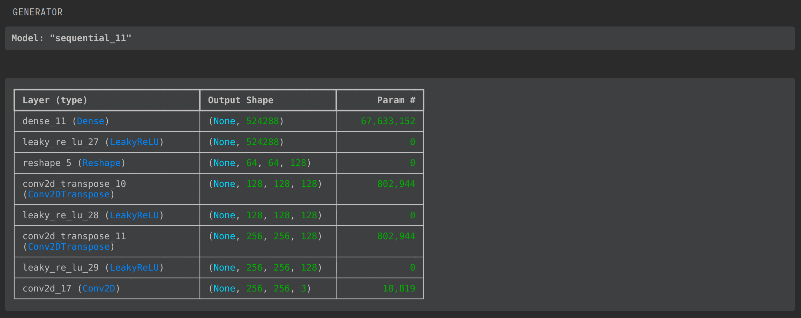

# `gan-monet`

https://www.kaggle.com/competitions/gan-getting-started/overview

## Data and EDA

We want to make pretty Monet pictures with electricity. Here are some real ones:

### Exploring the data

## The Model

I decided on a DCGAN with the following structure.

## How did it go?

We aren't going to win any prizes. Mostly because this training takes 4 minutes per epoch on my computer.

Next time I'll buy a laptop with CUDA capability and train more than 10 epochs.

